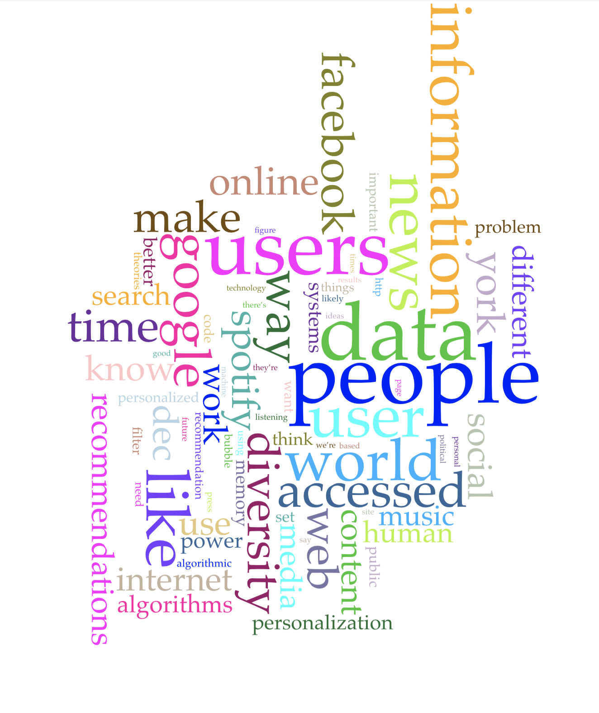
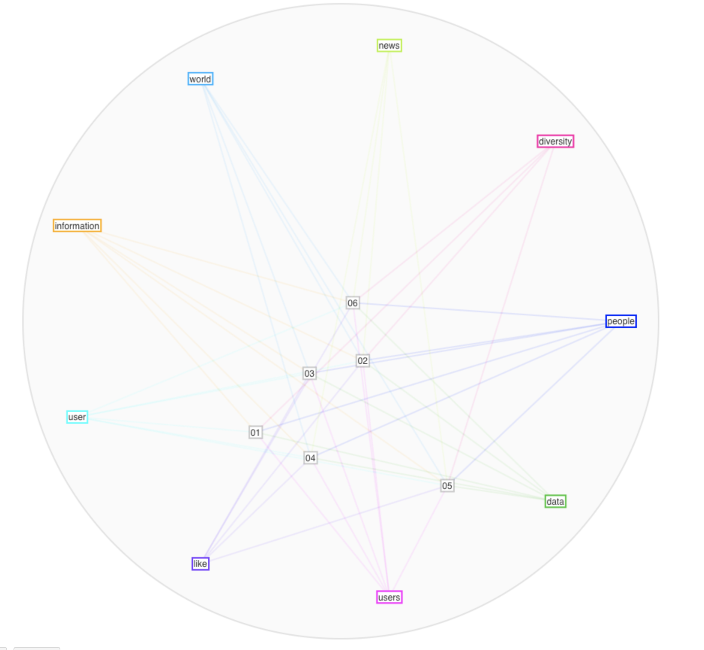

# Ejercicio Voyant
## Felipe Salas Noguera 201413117

##### [Corpus en Voyant](https://voyant-tools.org/?corpus=0784602c6486c66d8231621d7e99809d&panels=cirrus,reader,trends,summary,contexts)

### Primer Corpues
#### Palabras Más frecuentes
1. People
2. Data
3. Users
4. Like
5. User
6. Information
7. World
8. News
9. Google
10. Diversity

De estas palabras me parece importante diferenciar entre *usuarios* y *usuario* (Users and user). Los algoritmos de recomendación tienen en cuenta tanto lo individual y lo colectivo y hay diferencias en cómo se los estos datos en cada situación.

#### Palabras que excluiría

* http
* Facebook
* Google
* Spotify
* make
* online
* York

La mayoría de estas palabras las excluiría porque me permiten limpiar los gráficos (son organizaciones que ya sé que usan algoritmos de recomendación). Las otras porque no son de utilidad para mi proyecto ni para la busqueda de nueva información.

Este gráfico me ha ayudado a ver la relación entre mis fuentes, cuales son sus enfoques y el camino de investigación que debería seguir. 

* Buscar sobre los usuarios, los datos, y la diferencia entre usuarios y usuario.

#### Palabras Distintivas

De la lista de *Distinctive Words* podría agrupar y etiquetar las siguientes palabras:

##### Términos relacionados con el funcionamiento de los algoritmos

* gs (generalists/specialists)
* explanation(s)
* specialists
* generalists
* organic
* items

#### Términos relacionados con los usuarios

* generalists
* specialists
* diversity
* folk (theories)
* (folk) theories
* filter

#### Términos relacionados con el contenido

* organic
* items
* filte
* diversity

### Conclusiones

Gracias a este ejercicio sé que un buen punto para continuar la investigación es buscar acerca de los usuarios y su relación con los algoritmos. Asimismo, considero pertinente buscar información relevante acerca de los datos (likes) que los algoritmos usan en otras plataformas distintas a Spotify. La mayoría de mis fuentes están basadas en el algoritmo de Spotify y creo que me sería util tener un panorama más amplio en cuanto al funcionamiento del algoritmo en otras plataformas.
