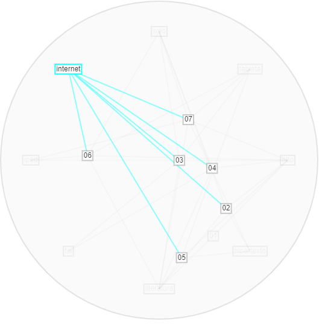
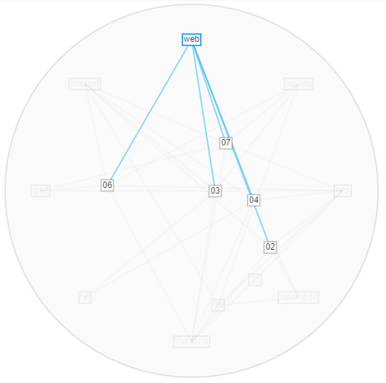

**Ejercicio Voyant Tools**

Inicialmente, las palabras más comunes fueron _http_, _hipertexto_, _leer_, _información_ y _forma_.    

Sin embargo, como se observa en el anterior gráfico de flujo, la palabra hipertexto se encuentra muy brevemente en los artículos 6 y 7, Y completamente ***ausente*** en 3, 4 y 5. Esto me lleva a pensar que, aunque hipertexto para mi proyecto sea una palabra _definitoria_, cuando se estudia transversalmente resulta redundante, pues pareciera que los textos estudiados la omiten no por su poca pertinencia sino por su obviedad: todo texto digital es entonces un _hipertexto_.  

Ahora, las palabras _leer_, _información_ y _forma_ no dicen nada sin un contexto específico. _Leer_ es un acto intrínseco del tema general de este proyecto -la literatura digital-, información sin un complemento que señale un _tipo_ o _manera_ es una palabra vacía, lo mismo pasa con _forma_ que a falta de un atributo específico no comunica nada. 
 

Así pues, habíendo eliminado dichas palabras, nos queda el siguiente gráfico:   

 
El cual es interesante por dos acepciones: _papel_ y el número _2013_. La palabra _papel_ resalta en este corpus porque referencia a otro _tipo_ de edición -la edición análoga. Esto puede conducirnos a pensar que la edición digital en sí misma no puede describirse, posicionarse, sin retomar elementos de su predecesora. En contraste, es muy interesante que aparezca el número _2013_ con esta frecuencia en la mayoría de los textos -se encuentra brevemente en los textos 2, 6 y 7, lo que representa menos del 50% del corpus. Esto puede indicar que en este año pasó algo importante para la edición digital, o bien, que muchos textos sobre este tema fueron escritos este año, o que hay un texto de este año muy importante que fue citado varias veces en casi todo el corpus -debo revisar cuál de estas posibilidades es la correcta. 
  

Con más depuración de términos nos resulta esta otra gráfica:   

 

Aquí, las nueva palabras más frecuentes son: _conocimiento_, _acceso_ y _nuevo_. Sin embargo, revisando la herramienta _contextos_ de Voyant Tools, podemos descartarlos, pues están ligados uno a otro en frases como "(...) nuevo acceso al conocimiento (...)". Aunque el ejemplo anterior sustentaría mi hipótesis "lo digital como el medio de acceso al conocimiento", no es pertinente en esta búsqueda cuntítativa de términos. No obstante, sí apunta a _validar_ este corpus por su pertinencia en mi pesquisa. 

  

Asimismo, otra depuración importante fue 

¿Cuáles son las palabras más comunes en sus artículos? 
¿Hay palabras que excluiría o incluiría en futuras consultas sobre su tema? 
Al revisar la lista de "distinctive words", ¿podría organizar bajo una etiqueta común algunas de ellas? 
En general, ¿ve alguna forma de acotar o ampliar sus búsquedas y/o tema de investigación después de hacer el ejercicio?
Extraiga de Voyant Tools las imágenes que considere pertinentes para su análisis.
