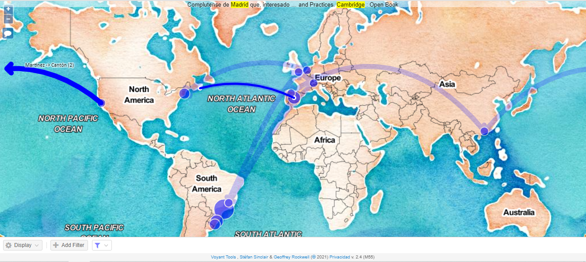

**Ejercicio Voyant Tools**

Inicialmente, las palabras más comunes fueron _http_, _hipertexto_, _leer_, _información_ y _forma_.    

Sin embargo, como se observa en el anterior gráfico de flujo, la palabra hipertexto se encuentra muy brevemente en los artículos 6 y 7, Y completamente ***ausente*** en 3, 4 y 5. Esto me lleva a pensar que, aunque hipertexto para mi proyecto sea una palabra _definitoria_, cuando se estudia transversalmente resulta dedundante, pues pareciera que los textos estudiados la omiten no por su poca pertinencia sino por su obviedad: todo texto digital es entonces un _hipertexto_.  

Ahora, las palabras _leer_, _información_ y _forma_ no dicen nada sin un contexto específico. _Leer_ es un acto intrínseco del tema general de este proyecto -la literatura digital-, información sin un complemento que señale un _tipo_ o _manera_ es una palabra vacía, lo mismo pasa con _forma_ que a falta de un atributo específico no comunica nada. 
 

Así pues, habíendo eliminado dichas palabras, nos queda el siguiente gráfico:    

¿Cuáles son las palabras más comunes en sus artículos? 
¿Hay palabras que excluiría o incluiría en futuras consultas sobre su tema? 
Al revisar la lista de "distinctive words", ¿podría organizar bajo una etiqueta común algunas de ellas? 
En general, ¿ve alguna forma de acotar o ampliar sus búsquedas y/o tema de investigación después de hacer el ejercicio?
Extraiga de Voyant Tools las imágenes que considere pertinentes para su análisis.
