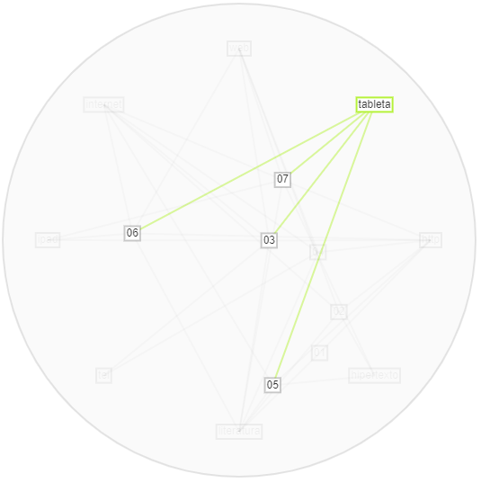

## Ejercicio Voyant Tools ##

  Inicialmente, las palabras más comunes fueron _http_, _hipertexto_, _leer_, _información_ y _forma_.   

Sin embargo, como se observa en el anterior gráfico de flujo, la palabra hipertexto se encuentra muy brevemente en los artículos 6 y 7, Y completamente ***ausente*** en 3, 4 y 5. Esto me lleva a pensar que, aunque hipertexto para mi proyecto sea una palabra _definitoria_, cuando se estudia transversalmente resulta redundante, pues pareciera que los textos estudiados la omiten no por su poca pertinencia sino por su obviedad: todo texto digital es entonces un _hipertexto_.  

Ahora, las palabras _leer_, _información_ y _forma_ no dicen nada sin un contexto específico. _Leer_ es un acto intrínseco del tema general de este proyecto —la literatura digital—, información sin un complemento que señale un _tipo_ o _manera_ es una palabra vacía, lo mismo pasa con _forma_ que a falta de un atributo específico no comunica nada. 
 

Así pues, habiendo eliminado dichas palabras, nos queda el siguiente gráfico:   

 
El cual es interesante por dos acepciones: _papel_ y el número _2013_. La palabra _papel_ resalta en este corpus porque referencia a otro _tipo_ de edición —la edición análoga. Esto puede conducirnos a pensar que la edición digital en sí misma no puede describirse, posicionarse, sin retomar elementos de su predecesora. En contraste, es muy interesante que aparezca el número _2013_ con esta frecuencia en la mayoría de los textos —se encuentra brevemente en los textos 2, 6 y 7, lo que representa menos del 50% del corpus. Esto puede indicar que en este año pasó algo importante para la edición digital, o bien, que muchos textos sobre este tema fueron escritos este año, o que hay un texto de este año muy importante que fue citado varias veces en casi todo el corpus —debo revisar cuál de estas posibilidades es la correcta. 
  

Con más depuración de términos nos resulta esta otra gráfica:   

 

Aquí, las nuevas palabras más frecuentes son: _conocimiento_, _acceso_ y _nuevo_. Sin embargo, revisando la herramienta _contextos_ de Voyant Tools, podemos descartarlos, pues están ligados uno a otro en frases como "(...) nuevo acceso al conocimiento (...)". Aunque el ejemplo anterior sustentaría mi hipótesis "lo digital como el medio de acceso al conocimiento", no es pertinente en esta búsqueda cuantitativa de términos. No obstante, sí apunta a _validar_ este corpus por su pertinencia en mi pesquisa. 
  
Asimismo, otra herramienta que iluminó mucho más el corpus fue _Mandala_:   

 

Este diagrama sí lo manipulé más arbitrariamente puesto que, después de analizar las evidencias que arrojaron los Gráficos de flujo que vimos anteriormente, generé mi propia lista de _palabras clave_ que considero personalmente vale la pena examinar a detalle dentro del corpus.

Revisemos las relaciones de los términos resultantes con los textos: 
**1. Hipertexto**
  
Aquí podemos evidenciar que este término, en efecto, no es transversal a todo el corpus, no es tan importante y, como se dijo anteriormente, se podría obviar. Definir un _hipertexto_ no es el "objetivo" de estos textos. 

**2. Literatura** 
  
A pesar de que este término puede parecer obvio en un corpus como este, creo que es importante que lo resaltemos pues esta palabra "aterriza" un poco este conjunto de textos. La edición en sí es algo bastante grande que, generalmente, alude a la literatura, pero **NO** es necesariamente constitutiva de la acción de _editar_. Su presencia en la totalidad de este corpus es señal, una vez, de la pertinencia, validez y _alineación_ con los objetivos de este proyecto —que son enteramente literarios.

**3. Web, internet y http**  
En este caso, el término predominante, presente en todos los textos, es _http_: 
   
Esto parece indicar que _http_ es el término que "definiría" el corpus. Sin embargo, si hacemos una indagación más profunda con la herramienta "Contextos", nos podemos dar cuenta que _http_ se repite en todo el corpus por su carácter literal y no referencial. Es decir, _http_ aparece en todos los textos porque se han citado direcciones electrónicas, pero no por su concepto de _Hypertext Transfer Protocol_. Entonces, debimos haberlo excluido antes.  

Por otro lado, _internet_ sólo se encuentra ausente en el texto 1: 
   

Y _web_ en 1 y 5: 
   
Esta frecuencia de estos términos indicaría que la edición digital se estaría volcando —según los autores— hacia la publicación en línea más que hacia otro tipo de distribución. Personalmente, me atrevería a asegurar que no se ha contemplado otro medio de distribución que no se internet y, tal vez, no otro receptáculo para la publicación digital que una _Web_. Aunque habría que revisar a qué se refiere cada artículo con estos términos, todo parece apuntar a que toda edición digital debe ser publicada _en línea_, y que no se ha concebido un proyecto de edición que no requiera de dicha conexión.

**4. Tableta y ipad**  
La frecuencia de esto dos términos llamó mi atención pues iluminó la pregunta ***¿dónde —en qué dispositivo— lee el nuevo lector digital?***, pues, hasta ahora, no habíamos contemplado la dificultad que presenta el _formato_ de lectura, en tanto que este sea "adaptable" a múltiples dispositivos de lectura —y aquí no entraron en discusión las Kindle. 
Ahora, en contraste, parece que, al menos en cuanto a términos concierne, el más popular y utilizado en este corpus fue _tableta_, presente en 57% aprox. del corpus —en 4 de 7 textos:
  

Y _ipad_ en el restante 43% aprox.
  

**5. Tei**  
Este último término es sumamente interesante si, una vez más, lo ponemos en contexto:
  
Como podemos observar, _tei_ se encuentra exclusivamente en los textos 3 y 4, que son _La edición crítica digital de textos teatrales_ y _La edición digital de textos literarios planteamientos y perspectivas de futuro_ respectivamente. Esto ilumina la problemática de ***¿cómo "digitalizar" la literatura?*** específicamente ***el teatro***, ya que se hace referencia a esta herramienta de marcado digital en el único texto del corpus que trata directamente ejemplos de edición digital de teatro —texto 3— y, más aún, en un texto que se piensa el porvenir del campo —texto 4. Esta es una pregunta técnica, pero vital para este proyecto porque uno de sus componentes —como edición de obras completas— es la obra dramática —que Gertrudis Gómez de Avellaneda produjo prolíferamente— y buscamos la mejor _manera_ de "digitalizar" dicha obra.

### Otros apuntes ###
En cuanto a Voyant Tools, quisiera destacar la herramienta _Dreamscape_, que está en desarrollo aún pero que ofrece un diagrama de posibles "conexiones" sobre un mapa geográfico. Es decir, muestra la "trayectoria geográfica" de los textos, de lo que hablan los textos y sus referencias, localizando las ciudades en el mapa y trazando líneas de "diálogo". Por ejemplo, en el corpus conectó la _Universidad Católica de Pelotas_, en Brasil, con la _Complutense_ de Madrid: 
   

Hay que reconocer que esta herramienta aún está en desarrollo y por eso tiene fallas como aquí, que confundió el apellido _Cantón_ con la ciudad China:   

Pero, en general puede ayudar a hacer conexiones geográficas que resultan interesantes para localizar espacialmente el diálogo, como esta entre Madrid —Universidad Complutense— y Cambridge:   

