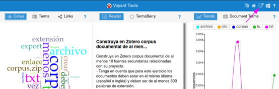
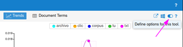

# Ejercicio con Voyant Tools sobre un corpus de textos

1. Entre a https://voyant-tools.org, haga clic en `Upload` y suba el archivo `Corpus.zip.`

2. Hecho eso, cree un enlace permanente para su corpus. Haga clic en el ícono de `Export URL`

y haga click en `Export`. Su corpus seguirá siendo accesible mientras lo abra por lo menos una vez al mes. Asegúrese de crear un "Bookmark" en su navegador guardando así el enlace de su corpus.

3. Los resultados iniciales seguramente no se verán muy interesantes. Dirá que las palabras más comunes son "más", "que", o "a" si está trabajando con documentos en español (o "a", "the" y "and" si está trabajando con documentos en inglés). Necesitamos filtrar estas palabras creando unas *stopwords* que serán excluidas del análisis. Haga clic en el botón "Define options for this tool":

y al lado del campo "Stopword-Auto-detect"; haga clic en "Edit list". Añada las palabras necesarias, guarde y dele click a “Confirm”. El corpus se podrá visualizar bien ahora.

