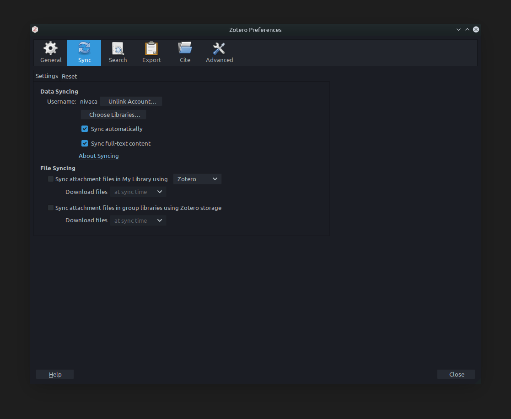

# Cómo usar Zotero para crear y administrar la bibliografía del proyecto de tesis

## Aplicación web de Zotero

1. Si no tienen una cuenta gratuita en Zotero aún, créenla aquí: https://www.zotero.org/user/register
2. Inicien sesión con su cuenta nueva de Zotero. Vayan ahora a su biblioteca (`Library`).
3. Desde esa aplicación web podrán administrar toda su biblioteca.

## Aplicación para computador de Zotero
1. Si lo desean, también pueden usar la aplicación de Zotero en su computador. Descárguenla aquí: https://www.zotero.org/download/ Seleccionen la opción según el sistema operativo que estén usando (Windows, MacOS o Linux).
2. Una vez instalado, vayan a las Preferencias y luego vayan a la pestaña de Sync:

3. Ahí deberán poner los datos de su cuenta personal de Zotero. Asegúrense de que tengan las mismas opciones seleccionadas que en la imagen.

